# 🚀 Home Lab Network Architecture

This document details the network architecture of my home lab. The project has evolved from a simple flat network into a robust Zero Trust infrastructure, combining traditional network segmentation with modern cloud security principles.

## 🎯 Design Philosophy

The network philosophy is built on four fundamental pillars:

**Security by Isolation:** Implementing network segmentation (VLANs) to isolate different types of traffic, minimizing the attack surface and protecting critical services.

**Zero Trust Security:** Adopting a "never trust, always verify" model where no access is trusted by default. Every request, whether internal or external, must be authenticated and authorized before reaching any resource.

**Centralized Control:** Utilizing unified platforms (UniFi for networking, Cloudflare for security) to manage infrastructure from centralized interfaces, enabling consistent policy enforcement and comprehensive monitoring.

**High Performance:** Employing dedicated network hardware and modern edge services to ensure stable connectivity, low latency, and capacity for future expansions.

## ✨ Key Architectural Advantages

This evolved design offers significant improvements in security, performance, and manageability:

**Zero Trust Access:** Replacing traditional VPN access with Cloudflare's Zero Trust platform eliminates exposed ports and provides identity-based access control for all external connections.

**Multi-Layer Security:** Combining edge security (Cloudflare WAF), identity verification (SSO), and network segmentation (VLANs) creates a defense-in-depth strategy.

**Unified Traffic Control:** All traffic, both internal and external, flows through a centralized reverse proxy (Nginx Proxy Manager), ensuring consistent policy application.

**Smart DNS Resolution:** Split-horizon DNS provides seamless access to services using different domains for internal (`*.local.example.com`) and external (`*.example.com`) users.

## 🌟 Evolution to Zero Trust

### The Initial Challenge
While the traditional network design with VLANs provided strong internal segmentation, external access remained a concern. The conventional approach of port forwarding or VPN servers created unnecessary exposure to the public internet and relied heavily on perimeter security.

### The Strategic Shift
The transition to a Zero Trust architecture addressed these limitations by implementing the principle of "never trust, always verify." By leveraging Cloudflare's edge network and Zero Trust platform, we eliminated all inbound firewall rules and moved authentication decisions to the edge, before traffic ever reaches our network.

### Technology Choices
Key components were carefully selected to create a seamless and secure access experience:
- **Cloudflare Tunnel:** Creates a secure, outbound-only connection that eliminates the need for exposed ports
- **Cloudflare Access:** Provides identity-aware proxying with SSO support, ensuring every request is authenticated
- **Nginx Proxy Manager:** Acts as the central traffic controller for both internal and external requests
- **AdGuard Home:** Enables split-horizon DNS for intelligent request routing

## 🏛️ Architecture Diagram

The diagram below illustrates our multi-layered architecture, showing both the Zero Trust external access path and internal network segmentation:

```mermaid
graph TD
    subgraph "External User (Internet)"
        User_External["🌍 External User"]
    end

    subgraph "Cloudflare Network (Zero Trust Perimeter)"
        CF_WAF["🛡️ WAF & Geo-Fence"]
        CF_Access["🔐 Access (SSO Login)"]
        CF_Tunnel["🔗 Secure Tunnel"]
        style CF_WAF fill:#f38020,stroke:#333,stroke-width:2px
        style CF_Access fill:#f38020,stroke:#333,stroke-width:2px
        style CF_Tunnel fill:#f38020,stroke:#333,stroke-width:2px
    end

    subgraph "Local Network (Homelab)"
        subgraph "Gateway & DNS"
            UGW["UniFi Gateway Lite<br/>(Internal Firewall)"]
            AdGuard["🌐 AdGuard Home<br/>(Internal DNS)"]
        end
        subgraph "Ingress & Management"
            Cloudflared["🛰️ cloudflared<br/>(Tunnel Agent)"]
            NPM["🚦 Nginx Proxy Manager<br/>(Reverse Proxy)"]
        end
        subgraph "Services"
            HA["Home Assistant"]
            WebUI["OpenWebUI"]
            OtherServices["..."]
        end
        User_Internal["💻 Internal User / VPN"]
    end

    User_External -- "1. https://service.example.com" --> CF_WAF
    CF_WAF --> CF_Access
    CF_Access --> CF_Tunnel
    CF_Tunnel --> Cloudflared
    
    Cloudflared -- "2. Forwards all public traffic to" --> NPM
    
    User_Internal -- "A. https://service.lab.example.com" --> AdGuard
    AdGuard -- "B. Replies with NPM's internal IP" --> User_Internal
    User_Internal -- "C. Connects directly to" --> NPM
    
    NPM -- "3. Routes request to correct service" --> HA
    NPM -- " " --> WebUI
    NPM -- " " --> OtherServices

    UGW -.-> UGW_Firewall_Rule(Firewall Rule<br>Block Direct IP Access)
    style UGW_Firewall_Rule fill:#e74c3c,color:#fff
```

## 🔒 Network Segmentation & Security (VLANs)

The network maintains strict internal segmentation through VLANs, each with specific security policies:

| Network Name | VLAN ID | Subnet | Purpose & Key Firewall Rules |
|--------------|---------|--------|------------------------------|
| Prod (Servers) | 10 | .../27 | For core infrastructure. Access restricted to NPM for service routing. |
| Cacau (Trusted) | 20 | .../27 | For trusted family devices. Access to authorized services via NPM only. |
| Mochi (Guest) | 30 | .../28 | Guest network with internet-only access. All local resources blocked. |
| IoT (Untrusted) | 40 | .../25 | IoT devices isolated. Can only communicate with Home Assistant. |

## 🔐 Perimeter & Application Security (Zero Trust Layers)

Our Zero Trust implementation consists of multiple coordinated security layers:

* **✅ No Open Ports:** Cloudflare Tunnel creates an outbound-only connection to the Cloudflare edge, eliminating the need for inbound firewall rules and hiding our IP address.

* **🔐 Identity-Aware Proxy:** Cloudflare Access authenticates every external request using SSO (Google/GitHub) before it reaches our network, ensuring only authorized users gain access.

* **🛡️ Edge Security:** Cloudflare WAF provides geographic restrictions and protection against common web vulnerabilities at the edge.

* **🚦 Unified Access Control:** Nginx Proxy Manager acts as the central point of access control, handling both external (tunneled) and internal traffic with consistent routing rules.

* **🌐 Smart DNS Resolution:** Split-horizon DNS provides seamless access using different domains for internal (`*.lab.example.com`) and external (`*.example.com`) users.

* **🧱 Defense in Depth:** UniFi firewall rules block direct IP access to services, ensuring all traffic flows through proper security controls.

## 🚦 Traffic Flow Examples

### Internal Traffic Flow (VLAN-to-VLAN)

1. A user on their laptop (connected to the "Cacau" Wi-Fi network, VLAN 20) accesses `https://webui.lab.example.com`
2. AdGuard Home resolves the domain to NPM's internal IP
3. The request travels through the UniFi AP, tagged for VLAN 20
4. The UniFi Gateway permits the traffic based on VLAN rules
5. NPM receives the request and routes it to the OpenWebUI container
6. The response follows the same path back to the user

### External Traffic Flow (Zero Trust Model)

1. An external user accesses `https://webui.example.com`
2. Cloudflare's WAF checks the request against security rules
3. Cloudflare Access prompts for SSO authentication via Google/GitHub
4. Upon successful authentication, the request is sent through the Cloudflare Tunnel
5. The local cloudflared agent receives the request and forwards it to NPM
6. NPM validates the request and routes it to the OpenWebUI container
7. The response travels back through the same secure path

## 🚀 Future Roadmap

With our Zero Trust foundation established, future improvements will focus on automation and observability:

- [ ] **Security Information and Event Management (SIEM):** Implement centralized logging and security analytics
- [ ] **Infrastructure as Code:** Automate the deployment of Zero Trust policies and network configurations
- [ ] **Enhanced Monitoring:** Deploy Prometheus and Grafana for comprehensive infrastructure and security metrics
- [ ] **Automated Compliance Checks:** Implement regular security posture assessments and compliance verification