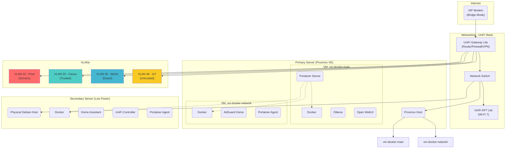

# 🚀 Home Lab Network Architecture

This document details the network architecture of my home lab. The project has evolved from a simple flat network into a robust and secure infrastructure, adopting professional-grade concepts to ensure performance and simplified management.

## 🎯 Design Philosophy

The network philosophy is based on three pillars:

**Security by Isolation:** Implementing network segmentation (VLANs) to isolate different types of traffic, minimizing the attack surface and protecting critical services.

**Centralized Control:** Utilizing the UniFi platform to manage all network hardware from a single interface, allowing for unified firewall policy enforcement and traffic monitoring.

**High Performance:** Employing dedicated network hardware to ensure stable connectivity, low latency, and capacity for future expansions.

## ✨ Key Architectural Advantages

This new design offers significant improvements in security, performance, and manageability:

**Virtualization with Proxmox:** Workloads are isolated into dedicated Virtual Machines. This prevents a single application failure from impacting the entire system and allows for efficient resource allocation.

**Centralized Management with Portainer:** A single web interface manages all three Docker environments, simplifying the deployment, monitoring, and maintenance of containerized services.

**Dedicated UniFi Network Stack:** Replacing the ISP router with a UniFi Gateway, Switch, and AP provides full control, enabling advanced firewalling, secure VPN, and VLAN implementation.

**Purpose-Built Servers:** The architecture uses a powerful server for heavy tasks (AI) and a low-power server for essential 24/7 services (home automation and network control), optimizing the performance-to-cost ratio.

## 🏛️ Architecture Diagram

The diagram below illustrates the multi-server topology and network traffic flow.

## 🔒 Network Segmentation & Security (VLANs)

The network is divided into four distinct VLANs, each with a specific purpose and strict firewall policies to control access and enhance security.

| Network Name | VLAN ID | Subnet | Purpose & Key Firewall Rules |
|--------------|---------|--------|------------------------------|
| Prod (Servers) | 10 | .../27 | For core infrastructure (Proxmox, VMs). Highly restricted access from other VLANs. |
| Cacau (Trusted) | 20 | .../27 | For trusted family devices. Can access: Home Assistant (Port 8123) and Open WebUI. |
| Mochi (Guest) | 30 | .../28 | For guests. Provides internet access only. Blocked from all local network resources. |
| IoT (Untrusted) | 40 | .../25 | For IoT devices. Isolated, cannot initiate contact with other VLANs. Can be accessed by Home Assistant. |

## 🚦 Example Traffic Flow

Here's how a request from a trusted device to a self-hosted service works in this architecture:

1. A user on their laptop (connected to the "Cacau" Wi-Fi network, VLAN 20) accesses the Open WebUI address.

2. The request travels from the laptop to the UniFi AP.

3. The AP tags the traffic for VLAN 20 and sends it to the UniFi Switch.

4. The Switch forwards the request to the UniFi Gateway.

5. The Gateway's firewall rules check if VLAN 20 is allowed to access the IP of the OpenWebUI service on the "Prod" network (VLAN 10). The rule permits this specific traffic.

6. The Gateway routes the request to the Proxmox Host, which passes it to the vm-docker-main VM.

7. The Open WebUI Docker container receives the request and serves the webpage back along the same path.

## 🚀 Future Roadmap

With the foundational architecture established, future improvements will focus on automation and observability:

- [ ] **High Availability (HA):** Implement a second AdGuard Home instance on the secondary server and configure them for HA to eliminate DNS as a single point of failure.

- [ ] **Infrastructure as Code (IaC):** Use Ansible to automate the setup and configuration of new VMs and Docker hosts, ensuring consistency and repeatability.

- [ ] **Monitoring & Logging:** Implement a Prometheus and Grafana stack to collect metrics from all servers, VMs, and services for detailed monitoring and alerting.