# 🌐 Network Architecture

## Overview

This document outlines the current logical architecture of my home lab network. The design philosophy is to centralize network control using powerful software, compensating for the limitations of consumer-grade hardware.

The network is currently a simple, flat structure, but core services like IP address assignment (DHCP) and name resolution (DNS) have been delegated from the ISP router to a dedicated server. This provides granular control, enhanced security, and network-wide ad-blocking.

## Logical Diagram

The diagram below illustrates the flow of network services. The ISP router now functions primarily as a modem and gateway, while the `jupiter` node handles all DHCP and DNS requests.

```mermaid
graph TD
    subgraph "Internet"
        UpstreamDNS[("Upstream DNS<br>e.g., Quad9 / Google")]
    end

    subgraph "Home Network"
        ISP[("ISP Modem/Router<br>Gateway: 192.168.1.1<br>DHCP Server: DISABLED")]
        
        subgraph "jupiter (Core Services Node)"
            AGH["🛡️ AdGuard Home<br>IP: 192.168.1.2<br>DHCP & DNS Server"]
        end

        subgraph "Clients"
            Client1["💻 mercury (Wi-Fi)"]
            Client2["📱 Phone (Wi-Fi)"]
            Client3["🖥️ PC (Ethernet)"]
        end

        ISP <--> Internet
        AGH -- "Forwards valid DNS queries" --> UpstreamDNS
        
        Clients -- "1. DHCP Request" --> AGH
        AGH -- "2. DHCP Lease (IP, Gateway, DNS)" --> Clients
        Clients -- "3. DNS Query (e.g., google.com)" --> AGH
        
        Clients -- "4. HTTP/S Traffic" --> ISP
    end

    style jupiter fill:#D5F5E3,stroke:#333,stroke-width:2px
```

## IP Addressing Scheme

| Parameter       | Value             | Notes                                           |
| --------------- | ----------------- | ----------------------------------------------- |
| **Network ID** | `192.168.1.0/24`    | A standard Class C private network.             |
| **Gateway** | `192.168.1.1`       | The IP address of the ISP Modem/Router.         |
| **DHCP Server** | `192.168.1.2`       | Handled by AdGuard Home on the `jupiter` node.  |
| **DNS Server** | `192.168.1.2`       | Handled by AdGuard Home on the `jupiter` node.  |
| **DHCP Pool** | `192.168.1.100` - `192.168.1.200` | Range of dynamic IPs assigned to clients. |

## Core Component Roles

### ISP Modem/Router
While it remains the physical gateway to the internet, its software role has been intentionally minimized.
* **DHCP Server:** The built-in DHCP server has been **disabled**.
* **DNS Forwarder:** The built-in DNS forwarder is no longer used by clients.
* **Current Function:** It acts as a modem, a simple L3 router (to perform NAT), and a Wi-Fi Access Point.

### AdGuard Home on `jupiter`
This container is the brain of the network. It runs on the `jupiter` node, which has a static IP (`192.168.1.2`) and a wired connection for maximum stability.
* **DHCP Server:** Assigns IP addresses to all connecting clients. This centralization ensures that every device on the network is configured correctly without manual intervention.
* **DNS Resolver & Blocker:** All DNS queries are sent here first. It checks queries against blocklists to prevent ads and trackers from ever loading. Legitimate queries are forwarded to an upstream DNS provider (e.g., Quad9 for security).
* **SafeSearch Enforcement:** AdGuard Home is configured to enforce SafeSearch on major search engines (Google, Bing, etc.) for all devices on the network, providing a layer of content filtering.

## Traffic Flow Example (New Client)

1.  A new device (e.g., a phone) connects to the Wi-Fi.
2.  The phone broadcasts a **DHCP Discover** message to find a DHCP server.
3.  The ISP router ignores the request.
4.  AdGuard Home on `jupiter` receives the broadcast and replies with a **DHCP Offer**, suggesting an IP address (`192.168.1.123`), the gateway (`192.168.1.1`), and itself as the DNS server (`192.168.1.2`).
5.  The client accepts the offer, completing the lease process. It is now on the network.
6.  When the user opens a browser to `example.com`, the phone sends a DNS query for `example.com` to `192.168.1.2`.
7.  AdGuard Home filters the query, finds it to be safe, and forwards the traffic to the internet.

## Current Limitations & Future Improvements

* **Single Point of Failure:** The biggest weakness of this design is that if the `jupiter` node goes down, the entire network loses DNS resolution and new devices cannot obtain an IP lease.
    * **Improvement:** Implement a high-availability (HA) DNS/DHCP setup. This can be achieved by setting up a second, synchronized AdGuard Home instance on another low-power device (like a Raspberry Pi) and using a tool like `keepalived` to manage a virtual IP.

* **Flat Network:** All devices—servers, user laptops, IoT gadgets—exist on the same logical network. This is not ideal for security.
    * **Improvement:** As outlined in the roadmap, the next major step is to introduce a managed switch and create multiple **VLANs** to isolate server traffic, IoT traffic, and user traffic from one another.

* **Reliance on ISP Router:** The network still depends on the ISP router for L3 routing and Wi-Fi. These devices are often unreliable and lack advanced features.
    * **Improvement:** Replace the ISP device with a dedicated router running professional-grade firmware like **pfSense** or **OPNsense**. This would offer robust firewalling, VPN capabilities, and more reliable performance.