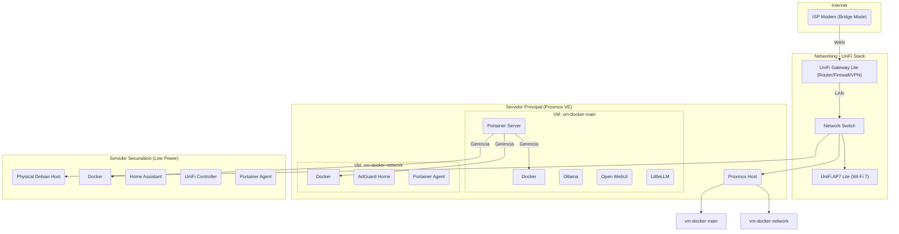

# 🚀 My Home Lab: From Videomaker to AI/DevOps Engineer

Welcome to my home lab repository! This project serves as my personal proving ground and portfolio, documenting my career transition journey into the world of tech, with a focus on **DevOps** and **AI Engineering**.

## 🎯 Guiding Principles

Coming from a 10-year background in audiovisual production, I believe in building robust solutions by blending creativity with technical efficiency. This lab is:

* **Practical:** Everything here runs on real hardware, solving everyday problems and serving real purposes.
* **Evolving:** It started simple and is constantly improving, with a clear roadmap for automation and scalability.
* **Documented:** I believe clear documentation is the foundation of any sustainable and collaborative project.

---

## 🏛️ Current Architecture

The infrastructure follows a professional-grade home lab setup, with proper network segmentation and virtualization.

### Network Segmentation

The network is divided into four distinct subnets, each with specific security policies:

| Subnet | CIDR | Purpose | Access Rights |
|--------|------|---------|---------------|
| **prod** | /27 | Production infrastructure | Full access to all services |
| **cacau** | /27 | Family network (medium security) | Access to OpenWebUI and Home Assistant |
| **mochi** | /28 | Guest network | Internet only, no internal services |
| **iot** | /25 | IoT devices | Restricted; only port 8223 accessible from prod network |

### Hardware

| Component | Specification | Function |
|-----------|--------------|-----------|
| **Main Server** | 12 Cores, 12 GB RAM | Proxmox VE host for main service VMs |
| **Secondary Server** | Dual Core (Low Power) | Debian host for 24/7 low-demand services |
| **Gateway/Firewall** | UniFi Gateway Lite | Router, Firewall, WireGuard VPN |
| **Access Point** | UniFi AP7 Lite | Wi-Fi 7, guest network, security management |
| **Switch** | Network backbone | Local network connectivity |
*For a more detailed overview, see the [Hardware & Network Documentation](./docs/hardware.md).*

### Software & Virtualization Stack

| Technology | Description |
|------------|-------------|
| **Hypervisor** | Proxmox VE - Installed on main server for VM management |
| **Operating System** | Debian - Base OS for secondary server and all VMs |
| **Containerization** | Docker - Used across all hosts to isolate and run services |
| **Management** | Portainer - Centralized management of 3 Docker environments (2 VMs + 1 physical host) |
| **Network** | UniFi Network - UniFi Controller manages Gateway and AP for complete network control |

---

## 🛠️ Services

This lab consists of three main service stacks distributed across virtual machines and physical hosts, all managed through Portainer for centralized control.

### AI and Management Stack (`vm-docker-main`)

This VM hosts the AI services and central management tools. Configuration is defined in `services/ai-stack/docker-compose.yml`.

| Service | Purpose | Network Access |
|---------|---------|----------------|
| **Portainer Server** | Central container management hub | prod only |
| **Ollama** | Local LLM execution engine | prod, cacau |
| **Open WebUI** | Web interface for Ollama models | prod, cacau |
| **LittleLLM** | API key and model access management | prod only |

### Network Services (`vm-docker-network`)

This VM handles network-level services. Configuration is in `services/network-services/docker-compose.yml`.

| Service | Purpose | Network Access |
|---------|---------|----------------|
| **AdGuard Home** | DNS-level ad/tracker blocking | prod only |
| **Portainer Agent** | Remote management endpoint | prod only |

### Home Automation Stack (Physical Server)

Running on the low-power physical server, these services manage home automation and network control. Configuration in `services/home-automation/docker-compose.yml`.

| Service | Purpose | Network Access |
|---------|---------|----------------|
| **Home Assistant** | Home automation orchestrator | prod, cacau, iot (8223) |
| **UniFi Controller** | Network device management | prod only |
| **Portainer Agent** | Remote management endpoint | prod only |

## 🗺️ Future Roadmap

This project is just the beginning. The next planned steps are:

-   [ ] **Monitoring:** Implement a Prometheus & Grafana stack for visibility into the lab's health and performance metrics.
-   [ ] **IaC with Ansible:** Automate the base configuration (package installation, Docker setup, security hardening) of all nodes.

---

Thanks for stopping by! Feel free to explore the repository and its documentation.