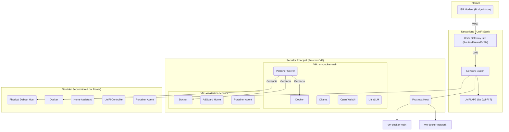

# 🏠 Home Lab 2.0 - Arquitetura e Documentação

Este repositório documenta a arquitetura e configuração do meu Home Lab pessoal (v2.0). O projeto é construído sobre um hipervisor Proxmox, com serviços distribuídos em contêineres Docker, gerenciado centralizadamente pelo Portainer e com uma infraestrutura de rede baseada em UniFi.

O objetivo principal é o auto-hospedagem de serviços, experimentação com IA/LLMs locais e automação residencial com Home Assistant.

## Diagrama da Arquitetura


```mermaid
graph TD
    subgraph "Internet"
        ISP_Modem("ISP Modem (Bridge Mode)")
    end

    subgraph "Networking - UniFi Stack"
        UGW["UniFi Gateway Lite (Router/Firewall/VPN)"]
        SW["Network Switch"]
        AP["UniFi AP7 Lite (Wi-Fi 7)"]
    end

    subgraph "Servidor Principal (Proxmox VE)"
        PVE("Proxmox Host")
        subgraph "VM: vm-docker-main"
            DockerMain["Docker"]
            PortainerServer("Portainer Server")
            Ollama("Ollama")
            OpenWebUI("Open WebUI")
            LittleLLM("LittleLLM")
        end
        subgraph "VM: vm-docker-network"
            DockerNet["Docker"]
            AdGuard("AdGuard Home")
            AgentNet("Portainer Agent")
        end
    end

    subgraph "Servidor Secundário (Low Power)"
        DebianServer("Physical Debian Host")
        DockerLP["Docker"]
        HA("Home Assistant")
        UniFiCtrl("UniFi Controller")
        AgentLP("Portainer Agent")
    end

    ISP_Modem -- "WAN" --> UGW
    UGW -- "LAN" --> SW
    SW --> PVE
    SW --> DebianServer
    SW --> AP

    PVE --> vm-docker-main
    PVE --> vm-docker-network

    PortainerServer -- "Gerencia" --> DockerMain
    PortainerServer -- "Gerencia" --> DockerNet
    PortainerServer -- "Gerencia" --> DockerLP
```

## 🛠️ Hardware

| Componente | Especificação | Função |
|---|---|---|
| **Servidor Principal** | 12 Cores, 12 GB RAM | Host Proxmox para VMs de serviços principais. |
| **Servidor Secundário** | Dual Core (Low Power) | Host Debian para serviços 24/7 de baixa demanda. |
| **Gateway/Firewall** | UniFi Gateway Lite | Roteador, Firewall, VPN WireGuard. |
| **Access Point** | UniFi AP7 Lite | Wi-Fi 7, rede de convidados e gerenciamento de segurança. |
| **Switch**  | Conectividade da rede local. |

## ⚙️ Software e Virtualização

| Tecnologia | Descrição |
|---|---|
| **Hipervisor** | **Proxmox VE** | Instalado no servidor principal para gerenciar máquinas virtuais. |
| **Sistema Operacional** | **Debian** | SO base para o servidor secundário e para todas as VMs. |
| **Conteinerização** | **Docker** | Utilizado em todos os hosts para isolar e executar os serviços. |
| **Gerenciamento** | **Portainer** | Gerencia de forma centralizada os 3 ambientes Docker (2 VMs + 1 host físico). |
| **Rede** | **UniFi Network** | O UniFi Controller gerencia o Gateway e o AP, provendo controle total da rede. |

## 📦 Serviços Hospedados

### Servidor Principal (VMs no Proxmox)

#### VM-1: `vm-docker-main`
- **Portainer Server**: Ponto central de gerenciamento dos contêineres.
- **Ollama**: Execução de modelos de linguagem (LLMs) localmente.
- **Open WebUI**: Interface web para interagir com os modelos do Ollama.
- **LittleLLM**: Gerenciamento de chaves de API para serviços de LLM.

#### VM-2: `vm-docker-network`
- **AdGuard Home**: Bloqueador de anúncios e rastreadores a nível de rede (DNS sinkhole).
- **Portainer Agent**: Permite que o Portainer Server gerencie este host.

### Servidor Secundário (Físico, Debian)
- **Home Assistant**: Orquestrador central para automação residencial.
- **UniFi Controller**: Software para gerenciamento dos dispositivos de rede UniFi.
- **Portainer Agent**: Permite que o Portainer Server gerencie este host.

## 🚀 Instalação e Configuração

A configuração deste ambiente é feita em múltiplas etapas, começando pela instalação do Proxmox e configuração da rede UniFi. Os serviços em Docker são implantados usando o Portainer (Stacks) ou a linha de comando.

Este repositório contém alguns artefatos que podem ser usados como referência:

- **`docker-compose.yml`**: Um exemplo de como subir os serviços de IA (Ollama, OpenWebUI, etc.) em um único host. Pode ser usado como base para um Stack no Portainer.
- **`setup.sh`**: Um script de instalação legado, útil para consulta de dependências e comandos de instalação para serviços específicos em um ambiente Debian.
- **`manage_llm.sh`**: Um script de exemplo para gerenciar instalações de Ollama e LittleLLM.

## 🔄 Manutenção e Backup

```bash
# Create backup directory
mkdir -p ~/backups/$(date +%Y%m%d)

# Backup de volumes do Docker (exemplo para o volume do ollama)
# Este comando deve ser executado no host Docker relevante
docker run --rm \
  -v ollama-data:/source \
  -v ~/backups/$(date +%Y%m%d):/backup \
  busybox tar czf /backup/ollama_backup_$(date +%Y%m%d).tar.gz -C /source .

# Backup da configuração do Home Assistant (se estiver usando a instalação Supervised)
sudo tar czf \
  ~/backups/$(date +%Y%m%d)/homeassistant_backup_$(date +%Y%m%d).tar.gz \
  /usr/share/hassio/homeassistant/
```

## 📝 Notes

- Replace `your-server-ip` with your actual server IP address
- Ensure ports 3000, 8123, and 11434 are open in your firewall
- For production use, consider setting up HTTPS with a reverse proxy like Nginx

## 🤝 Contributing

Feel free to submit issues and enhancement requests.

## 📄 License

This project is licensed under the MIT License - see the [LICENSE](LICENSE) file for details.
