# 🚀 My Home Lab: From Videomaker to AI/DevOps Engineer

Welcome to my home lab repository! This project serves as my personal proving ground and portfolio, documenting my career transition journey into the world of tech, with a focus on **DevOps** and **AI Engineering**.

## 🎯 Guiding Principles

Coming from a 10-year background in audiovisual production, I believe in building robust solutions by blending creativity with technical efficiency. This lab is:

* **Practical:** Everything here runs on real hardware, solving everyday problems and serving real purposes.
* **Evolving:** It started simple and is constantly improving, with a clear roadmap for automation and scalability.
* **Documented:** I believe clear documentation is the foundation of any sustainable and collaborative project.

---

## 🏛️ Current Architecture

The infrastructure is intentionally simple, built on repurposed hardware with a focus on energy efficiency.

```mermaid
graph TD
    subgraph "Local Network (192.168.1.0/24)"
        direction LR
        Router("🌐 ISP Modem/Router")

        subgraph "AI Node (Surface Pro 4 | Wi-Fi)"
            direction TB
            DockerAI["🐳 Docker"]
            Ollama["🤖 Ollama"]
            OpenWebUI["💬 Open WebUI"]
            LLM["🧠 Local LLM"]
            DockerAI --> Ollama
            DockerAI --> OpenWebUI
            DockerAI --> LLM
        end

        subgraph "Core Services Node (Dual-Core Notebook | Ethernet)"
            direction TB
            DockerCore["🐳 Docker"]
            AdGuard["🛡️ AdGuard Home"]
            HomeAssistant["🏠 Home Assistant"]
            DockerCore --> AdGuard
            DockerCore --> HomeAssistant
        end

        Router --> AI_Node
        Router --> Core_Services_Node
    end

    style AI_Node fill:#D6EAF8,stroke:#333,stroke-width:2px
    style Core_Services_Node fill:#D5F5E3,stroke:#333,stroke-width:2px
```

*For a more detailed overview, see the [Hardware & Network Documentation](./docs/hardware.md).*

### Hardware

* **AI Node (`mercury`):** A Microsoft Surface Pro 4 serving as an experimentation server for AI/ML models.
* **Core Services Node (`jupiter`):** A generic dual-core notebook running critical, always-on services.

### Software Stack

* **OS:** Debian 12 (with a custom kernel for the Surface hardware)
* **Containerization:** Docker & Docker Compose
* **DNS & Security:** AdGuard Home
* **AI & LLMs:** Ollama, Open WebUI
* **Automation:** Home Assistant

---

## 🛠️ Services

This lab is composed of two main stacks, each running on a dedicated node. The services are deployed using Docker Compose, with separate configurations for each stack.

### Core Infrastructure (`jupiter` node)

These are the foundational, always-on services that manage the network and home automation. They are defined in `services/core-infra/docker-compose.yml`.

| Service          | Purpose                                               |
| ---------------- | ----------------------------------------------------- |
| **AdGuard Home** | Network-wide ad-blocker and secure DNS resolver.      |
| **Home Assistant** | Orchestrator for home automation and task scheduling. |

### AI Stack (`mercury` node)

This stack is dedicated to experimenting with local Large Language Models (LLMs) and related tools. It is defined in `services/ai-stack/docker-compose.yml`.

| Service          | Purpose                                               |
| ---------------- | ----------------------------------------------------- |
| **Ollama**       | Framework for serving local language models (LLMs).   |
| **Open WebUI**   | User-friendly chat interface for the LLMs.            |
| **LiteLLM**      | API proxy to manage keys and standardize model access.|

## 🗺️ Future Roadmap

This project is just the beginning. The next planned steps are:

-   [ ] **Network Segmentation:** Create VLANs to isolate infrastructure, IoT devices, and the main user network for enhanced security.
-   [ ] **Dedicated Server:** Migrate services to a more robust server (e.g., a mini PC) running Proxmox VE for better virtualization and resource management.
-   [ ] **Monitoring:** Implement a Prometheus & Grafana stack for visibility into the lab's health and performance metrics.
-   [ ] **IaC with Ansible:** Automate the base configuration (package installation, Docker setup, security hardening) of all nodes.

---

Thanks for stopping by! Feel free to explore the repository and its documentation.